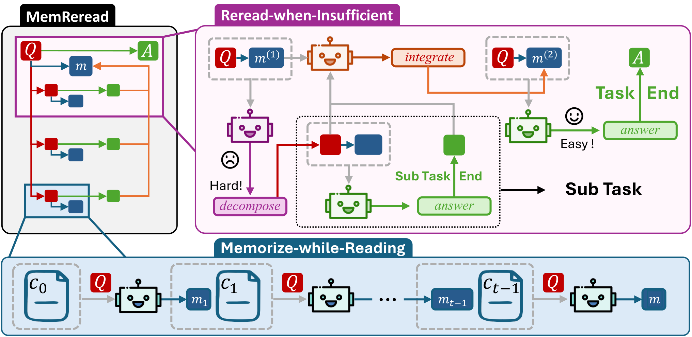

<div align="center">

#  MemReread: Enhancing Agentic Long-Context Reasoning via Memory-Guided Rereading

[](xxx)
[](https://huggingface.co/iiiiGray/MemReread-4B)
[](https://modelscope.cn/collections/iiGray/MemReread)

[](https://opensource.org/licenses/Apache-2.0)
[](https://www.python.org/downloads/)

</div>



---

## 📖 Overview

**MemReread** is a memory-guided LLM agent that decomposes the task to isolate its highest-priority sub-question based on its memory, then performs rereading guided by the generated sub-question, and directly answers according to the sub-memory, finally updating the root memory with the sub-question-answer pair.


## ⚡ Quick Start (Inference)

Here is a minimal example of how to use MemReread for context reading and reasoning.

<details>
<summary><b> 👇 Click to expand the Interface</b></summary>

```python
from exp.interface.mem_reread_api import MemReread_API
```

</details>

Alternatively, simply run the provided `quick_start.py` to test the API-based MemReread workflow:

```bash
python quick_start.py \
    --tokenizer-model /path/to/tokenizer \
    --model your-target-model \
    --base-url "your_base_url" \
    --api-key "your_api_key" \
    --max-reread 2
```


## 💻 System Environment

MemReread flexibly supports both **Local Deployment** and lightweight **API-based Inference**. We recommend the following environment based on your usage scenario:

| Component | Specification | Notes |
| :--- | :--- | :--- |
| **Python** | 3.10+ | Required for all modes |
| **Hardware (API Mode)** | CPU Only | No specific GPU required for API-based inference |
| **CUDA (Local Mode)** | 11.8+ / 12.x | Required for local GPU acceleration |
| **GPU (Local Mode)** | NVIDIA A100 / A800 (80GB) | Recommended for local model training & inference |

## ⚙️ Environment & Installation

### 1. Setup Python Environment

First, clone the repository and set up the dependencies from `requirements.txt`.

```bash
cd MemReread
pip install -r requirements.txt
```

### 2. Install Flash Attention

To accelerate training and inference, Flash Attention is required.

> **⚠️ IMPORTANT:**  
> Download the suitable version of `flash_attn` for your CUDA and PyTorch setup from the [Official Releases](https://github.com/Dao-AILab/flash-attention/releases).

```bash
# Replace with the path to your downloaded whl file
pip install <path_to_flash_attn_whl_file>
```

## 📚 Data Preparation

Training and evaluation data should be placed in the `datas/training_data/` directory. For example, our training scripts default to using `hotpotqa` datasets in parquet format:
- `datas/training_data/hotpotqa_train.parquet`
- `datas/training_data/hotpotqa_dev.parquet`

Ensure your data is properly formatted before starting the training process.

## 🏃 Training

We provide a training script `train_4B.sh` pre-configured for 4B parameter models (e.g., Qwen3-4B). It uses `verl` with ReA-GRPO to fine-tune the model's abilities.

```bash
# Grant execution permission
chmod +x train_4B.sh

# Start the training
bash train_4B.sh
```

> **Configuration:** Hyperparameters can be modified directly inside `train_4B.sh`. The default script is configured for 8 GPUs on a single node.


## 🌟 Acknowledgements

We would like to thank **[verl](https://github.com/volcengine/verl)** team for providing a flexible and powerful reinforcement learning infrastructure that made our training process possible. We also extend our thanks to the developers of **[MemAgent](https://github.com/BytedTsinghua-SIA/MemAgent)** for their excellent interface design and foundational contributions.


## 📊 Evaluation

We provide ready-to-use evaluation scripts to assess the model's reasoning capabilities on long-context tasks. 

### Local Model Evaluation

**1. Download fine- tuned Weights**  
First, acquire the fine-tuned model checkpoint from our Hugging Face repository: [MemReread-4B](https://huggingface.co/iiiiGray/MemReread-4B). Ensure you configure the correct model path inside the shell scripts before proceeding.

**2. Execute Evaluation**  
```bash
# Run the preliminary evaluation
bash run_preliminary.sh

# Run the main experiment evaluation
bash run_eval.sh
```
